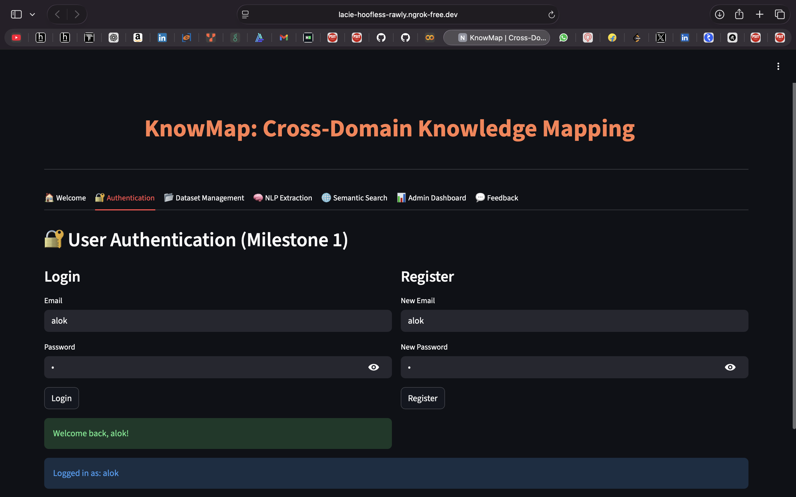
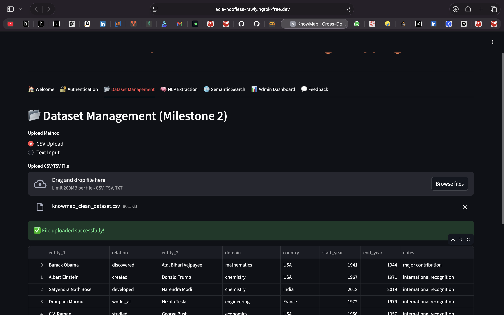
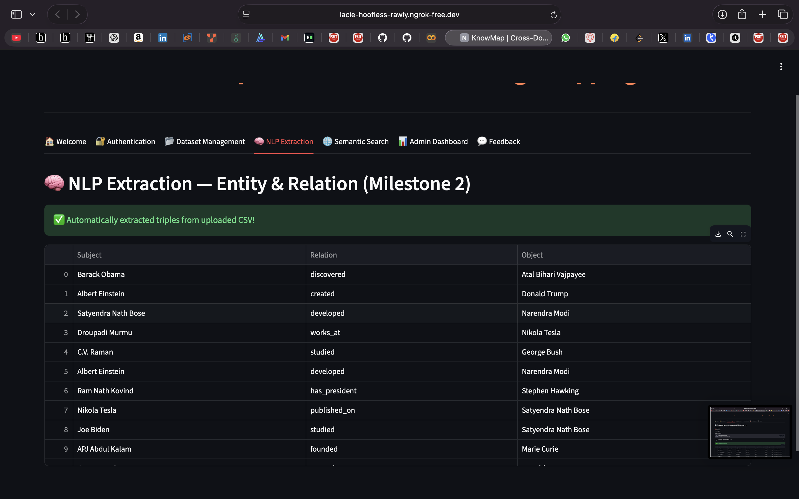
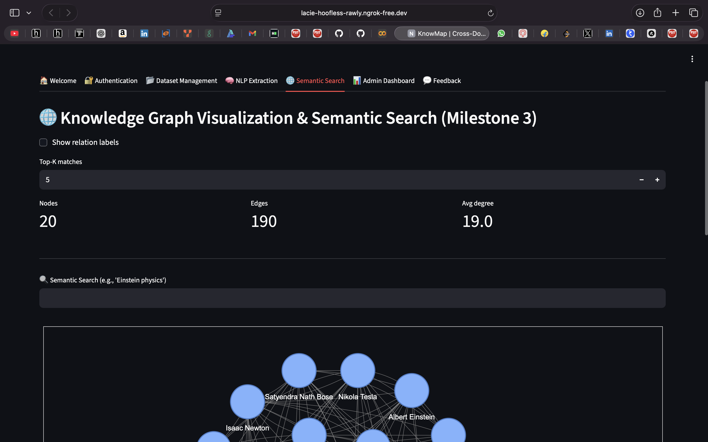
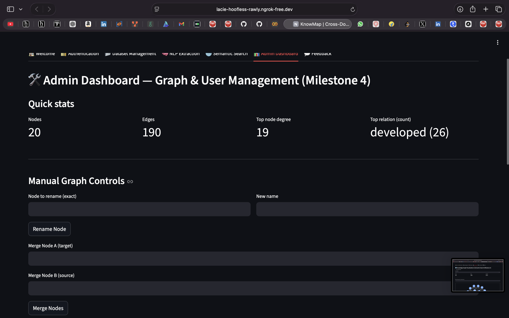
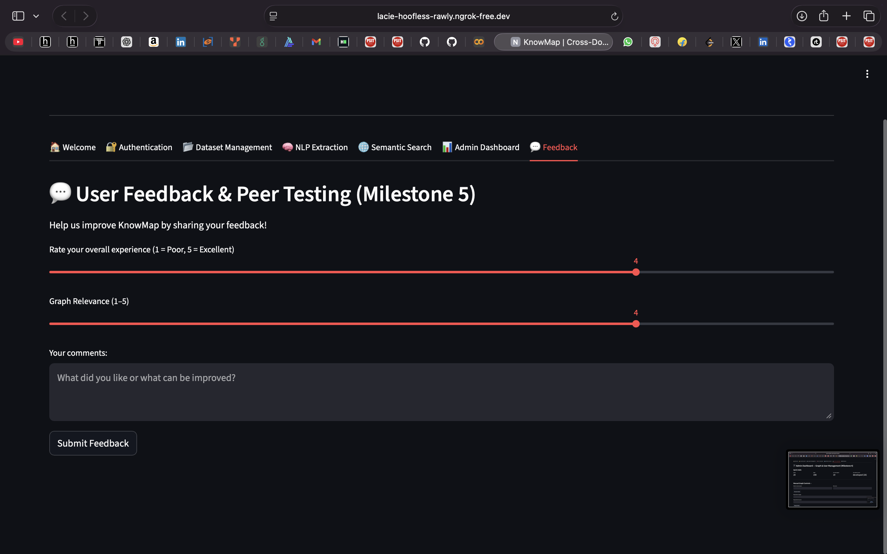

# 🚀 KnowMap — Cross-Domain Knowledge Mapping using AI  
A full AI-powered system built step-by-step through multiple milestones in Google Colab.

KnowMap analyzes text from different knowledge domains (Science → Business → Technology → etc.), extracts key concepts, generates semantic embeddings, and creates an interactive knowledge graph that shows cross-domain relationships.

This project was developed milestone-by-milestone and finally deployed using **Streamlit + Ngrok**.

---

## 📘 About the Project

**KnowMap** is an AI system designed and built by **Alok Yadav**.  
It performs:

- NLP-based keyphrase extraction  
- Sentence-Transformer embedding generation  
- Knowledge graph creation using NetworkX + PyVis  
- Cross-domain similarity linking  
- Interactive visualisation through Streamlit  
- Optional storage in Neo4j  

This project was created entirely in **Google Colab**, with code executed milestone-by-milestone in clean modular cells.

---

# 📌 Milestones Overview

### **🧩 Milestone 1 — Dataset Upload & Cleaning**
- Upload multiple domain documents  
- Preprocess text  
- Remove stopwords, special characters  
- Convert to clean tokenized text  

---

### **🧩 Milestone 2 — NLP Concept Extraction**
- Use spaCy `"en_core_web_sm"`  
- Extract Nouns, Noun-Phrases, Keywords  
- Store domain-wise keyword lists  

---

### **🧩 Milestone 3 — Embedding Generation**
- Use **Sentence-Transformer** (`all-MiniLM-L6-v2`)  
- Convert extracted concepts to embeddings  
- Store embeddings for cross-domain comparison  

---

### **🧩 Milestone 4 — Knowledge Graph Creation**
- Build graph using NetworkX  
- Add similarity-based edges  
- Use PyVis for interactive graph visualisation  

---

### **🧩 Milestone 5 — Streamlit App Deployment**
- Integrated all milestones into one app  
- Launched via **Ngrok** from Colab  
- User uploads multiple domain files, generates graph, and explores it live

---

# 📁 Folder Structure

```bash
Knowmap-cross-domain-knowledge-mapping-using-AI/
│
├── app.py                     # Final Streamlit App (All milestones integrated)
├── knowmap_cross_domain_knowledge_mapping_using_ai_.py  # Colab exported code
├── requirements.txt           # Libraries required
│
├── milestones/
│   ├── milestone_1_dataset.py
│   ├── milestone_2_nlp.py
│   ├── milestone_3_embedding.py
│   ├── milestone_4_graph.py
│   └── milestone_5_streamlit.py

---

```

## 🖼️ Application Screenshots

### 🔐 User Authentication


### 📁 Dataset Management


### 🧠 NLP Extraction — Entities & Relations


### 🔍 Knowledge Graph Visualization & Semantic Search


### 🛠️ Admin Dashboard


### 💬 User Feedback & Peer Testing



